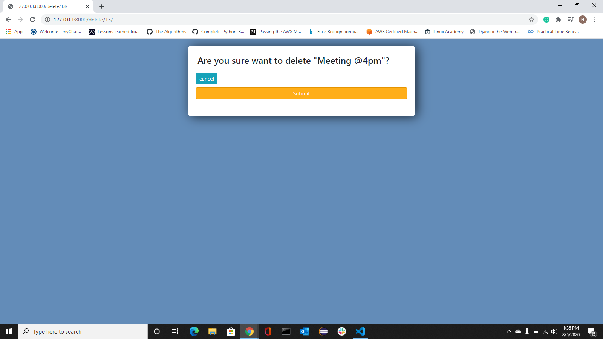

# to-do

A simple Django web app for daily use.I have recently deployed it on heroku server. Here is my [To-do](https://nsn-todo.herokuapp.com/) app. Feel free to use it anytime!

### Homepage

### Update Task

### Delete Task 

### After changes

