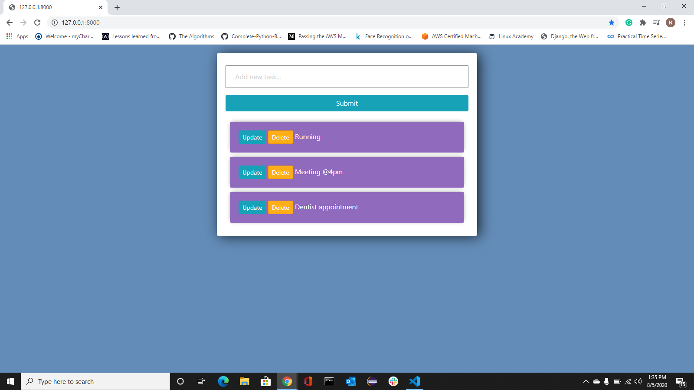
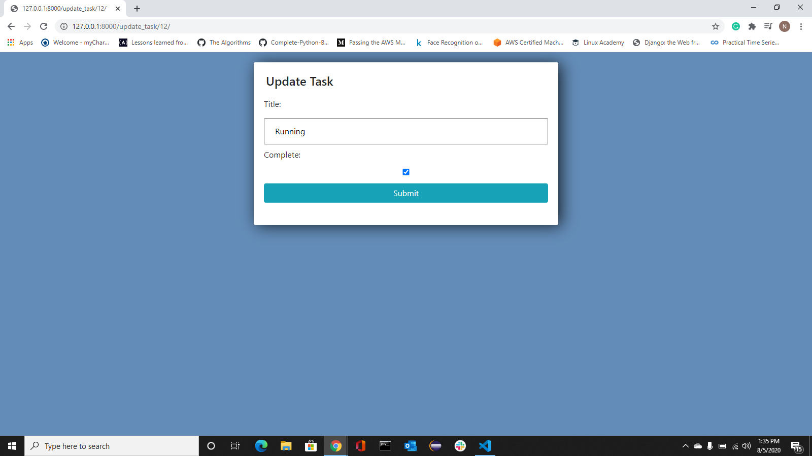
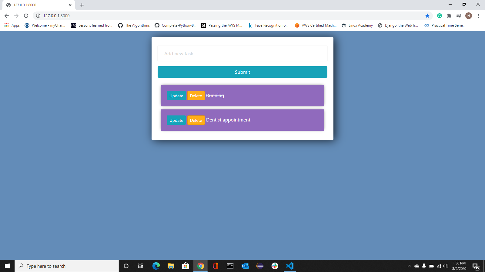

# to-do

A simple Django web app for daily use.

### Homepage

### Update Task

### Delete Task 

### After changes

### Website

I have recently deployed it on heroku server. Here is my [to-do](https://nsn-todo.herokuapp.com/). Feel free to use it anytime!
